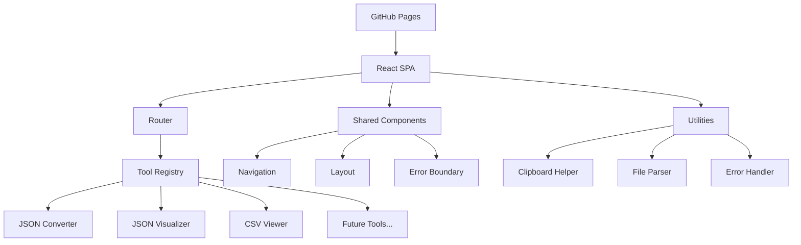

# Design Document

## Overview

The dev tools website will be a single-page React application (SPA) built with Vite and deployed to GitHub Pages. The architecture emphasizes modularity and extensibility, allowing new tools to be added with minimal configuration. The application will use client-side routing and maintain state locally without requiring a backend.

## Architecture

### High-Level Architecture



### Technology Stack

- **Frontend Framework**: React 19+ with functional components and hooks
- **Routing**: React Router v7 with HashRouter for GitHub Pages compatibility
- **UI Components**: shadcn/ui component library for consistent, accessible components
- **Styling**: Tailwind CSS for utility-first styling and design system
- **Build Tool**: Vite for fast development and optimized production builds
- **Testing**: Vitest with jsdom for unit and integration testing
- **Deployment**: GitHub Pages with gh-pages package for deployment
- **State Management**: React's built-in useState and useContext for local state
- **Performance**: React.lazy for code splitting and dynamic imports
- **Package Management**: npm with regular security audits and dependency updates
- **TypeScript**: Full TypeScript support with strict type checking

## Components and Interfaces

### Core Components

#### 1. App Component
- Root component that provides routing and global context
- Manages theme and global error boundaries
- Handles client-side routing configuration

#### 2. Navigation Component
- Responsive navigation bar with tool links using shadcn/ui NavigationMenu
- Mobile-friendly hamburger menu with shadcn/ui Sheet component
- Active route highlighting with Tailwind CSS classes
- Tool registry integration for dynamic menu items

#### 3. Layout Component
- Consistent page structure across all tools using Tailwind CSS grid/flexbox
- Header with navigation using shadcn/ui components
- Main content area with proper spacing using Tailwind CSS spacing utilities
- Footer with links and attribution styled with Tailwind CSS

#### 4. Tool Registry System
```typescript
interface Tool {
  id: string;
  name: string;
  path: string;
  component: React.LazyExoticComponent<React.ComponentType>;
  description: string;
  icon?: string;
}

interface ToolRegistry {
  tools: Tool[];
  registerTool: (tool: Tool) => void;
  getTool: (id: string) => Tool | undefined;
  getAllTools: () => Tool[];
}
```

#### 5. Individual Tool Components

**JSON Converter Component**
- Dual-pane interface using shadcn/ui Card and Textarea components
- Real-time conversion with debounced input
- Error handling using shadcn/ui Alert components
- Copy to clipboard functionality with shadcn/ui Button components
- Format toggle using shadcn/ui Toggle or Switch components

**JSON Visualizer Component**
- Tree view with expand/collapse functionality using shadcn/ui Collapsible
- Syntax highlighting for different data types with Tailwind CSS colors
- Search functionality using shadcn/ui Input component
- Copy individual values with shadcn/ui Button components
- Performance optimization for large objects

**CSV Viewer Component**
- Table display using shadcn/ui Table components with configurable row limits
- Header detection and display with proper table styling
- Pagination using shadcn/ui Pagination component for large files
- File upload using shadcn/ui Input (file type) and text paste support
- Export functionality with shadcn/ui Button components

### Shared Utilities

#### 1. Clipboard Helper
```typescript
interface ClipboardHelper {
  copy: (text: string) => Promise<boolean>;
  isSupported: () => boolean;
}
```

#### 2. File Parser
```typescript
interface FileParser {
  parseCSV: (content: string) => ParsedCSV;
  parseJSON: (content: string) => ParsedJSON;
  validateJSON: (content: string) => ValidationResult;
}
```

#### 3. Error Handler
- Centralized error handling and user-friendly messages
- Error boundary implementation
- Logging for debugging (development only)

## Data Models

### Tool State Management
Each tool maintains its own local state using React hooks:

```typescript
// JSON Converter State
interface JSONConverterState {
  input: string;
  output: string;
  mode: 'stringify' | 'parse';
  error: string | null;
  isValid: boolean;
}

// JSON Visualizer State
interface JSONVisualizerState {
  input: string;
  parsedData: any;
  expandedNodes: Set<string>;
  error: string | null;
  searchTerm: string;
}

// CSV Viewer State
interface CSVViewerState {
  rawData: string;
  parsedData: ParsedCSV;
  displayRows: number;
  currentPage: number;
  hasHeaders: boolean;
  error: string | null;
}
```

### Parsed Data Structures
```typescript
interface ParsedCSV {
  headers: string[];
  rows: string[][];
  totalRows: number;
  hasHeaders: boolean;
}

interface ParsedJSON {
  data: any;
  isValid: boolean;
  error?: string;
}
```

## Error Handling

### Error Boundary Strategy
- Global error boundary at the App level
- Tool-specific error boundaries for isolated failures
- Graceful degradation with user-friendly error messages
- Development vs production error display

### Error Types and Handling
1. **Parse Errors**: Invalid JSON/CSV format
2. **File Size Errors**: Files too large for browser processing
3. **Network Errors**: GitHub Pages routing issues
4. **Runtime Errors**: Unexpected JavaScript errors

### User Feedback
- Toast notifications using shadcn/ui Toast component for successful operations
- Inline error messages using shadcn/ui Alert component for validation failures
- Loading states using shadcn/ui Skeleton and Spinner components for async operations
- Clear error recovery instructions with shadcn/ui Alert and Button components

## Testing Strategy

### Unit Testing
- Vitest and React Testing Library for component testing
- Test utilities for common operations (parsing, validation)
- Mock implementations for clipboard and file operations
- Coverage targets: >80% for critical paths

### Integration Testing
- End-to-end testing with Playwright MCP tool for browser automation
- Cross-browser compatibility testing using Playwright's multi-browser support
- Mobile responsiveness testing with Playwright's device emulation
- GitHub Pages deployment testing with real browser interactions

### UI Testing with Playwright MCP
- **Browser Automation**: Use Playwright MCP tool for automated UI testing
- **User Interaction Testing**: Simulate real user workflows (clicking, typing, navigation)
- **Visual Testing**: Take screenshots and validate UI components render correctly
- **Responsive Testing**: Test across different viewport sizes and devices
- **Tool-Specific Testing**: Validate JSON conversion, visualization, and CSV viewing functionality

### Performance Testing
- Large file handling (JSON/CSV)
- Memory usage monitoring
- Bundle size optimization
- Lighthouse performance audits

### Development Testing Workflow
- **Start Dev Server**: Run `npm run dev` or `npm start` to start Vite development server
- **Browser Testing**: Use Playwright MCP tool to navigate to `http://localhost:5173` (default Vite port)
- **Automated Testing**: Execute UI tests using Playwright MCP for comprehensive browser testing

## Deployment and GitHub Pages Configuration

### Build Configuration
- Vite with `base` configuration set for GitHub Pages
- Client-side routing support with 404.html fallback for SPA routing
- Asset optimization and code splitting with Vite's built-in optimizations
- Environment-specific configurations
- TypeScript compilation with strict type checking

### GitHub Actions Workflow
```yaml
# Automated deployment on push to main branch
# Build optimization and caching
# Automated testing before deployment
# GitHub Pages deployment with proper permissions
```

### Routing Configuration
- Hash routing for GitHub Pages compatibility
- Deep linking support for individual tools
- URL structure: `/#/tool-name`
- Fallback handling for direct URL access

## Performance Considerations

### Code Splitting
- Lazy loading for individual tool components
- Dynamic imports for large dependencies
- Route-based code splitting

### Memory Management
- Efficient handling of large CSV files
- JSON tree virtualization for large objects
- Cleanup of event listeners and timers
- Debounced input processing

### Bundle Optimization
- Tree shaking for unused code elimination
- Vite's built-in bundle analysis and optimization
- CDN usage for common libraries
- Gzip compression for static assets
- Modern ES modules for better performance

## Extensibility Design

### Adding New Tools
1. Create tool component following established patterns
2. Add tool configuration to registry
3. Implement required interfaces (error handling, state management)
4. Add routing configuration
5. Update navigation automatically

### Plugin Architecture
- Standardized tool interface for consistency using shadcn/ui component patterns
- Shared utility functions and shadcn/ui components
- Common styling and theming system using Tailwind CSS configuration
- Automated integration with navigation and routing using shadcn/ui NavigationMenu

### Future Enhancements
- Tool categories and organization
- User preferences and settings persistence
- Import/export functionality for tool configurations
- Keyboard shortcuts and accessibility improvements